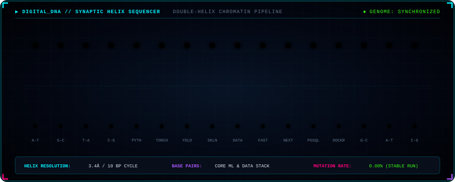

div align="center">

<!-- ======================================================== -->
<!-- 1. HERO / NEURAL CORE                                    -->
<!-- ======================================================== -->
<picture>
  <source media="(prefers-color-scheme: dark)" srcset="assets/hero.svg">
  <source media="(prefers-color-scheme: light)" srcset="assets/hero.svg">
  
</picture>
<br/><br/>

<!-- ======================================================== -->
<!-- 2. GITHUB CONTRIBUTION SNAKE (IMMEDIATELY AFTER HERO)   -->
<!-- ======================================================== -->
<picture>
  <source media="(prefers-color-scheme: dark)" srcset="https://raw.githubusercontent.com/hustsak/hustsak/output/github-contribution-grid-snake-dark.svg">
  <source media="(prefers-color-scheme: light)" srcset="https://raw.githubusercontent.com/hustsak/hustsak/output/github-contribution-grid-snake.svg">
  
</picture>

<br/>
<!-- ======================================================== -->
<!-- 3. ANIMATED SYSTEM STATUS / TYPING                       -->
<!-- ======================================================== -->
<a href="https://github.com/hustsak">
  
</a>


<p align="center">
  
  
  
  
  
</p>

</div>

---

<!-- ======================================================== -->
<!-- 4. DIGITAL DNA                                           -->
<!-- ======================================================== -->
### DNA

<div align="center">
  
</div>

<div align="center">

#### 🔹 PROGRAMMING LANGUAGES


#### 🔹 AI / MACHINE LEARNING / COMPUTER VISION


#### 🔹 DATA SCIENCE / EDA


#### 🔹 BACKEND & WEB SYSTEMS


#### 🔹 LAB WORKBENCH & DEVTOOLS


</div>

---

<!-- ======================================================== -->
<!-- ======================================================== -->
<!-- 5. CLASSIFIED AI RESEARCH LAB                            -->
<!-- ======================================================== -->
### 🔬 CLASSIFIED AI RESEARCH LAB

<div align="center">
  
</div>

| DIRECTIVE | CLASSIFICATION | STATUS | RESEARCH FOCUS |
| :--- | :--- | :--- | :--- |
| **CURRENT RESEARCH** | LEVEL-05 | `RUNNING` 🟢 | **Machine Learning for Business Intelligence & Predictive Analytics** |
| **ACTIVE EXPERIMENT** | LEVEL-04 | `PROCESSING`🔵 | **Computer Vision — Object Detection & Multi-Object Tracking** |
| **SPECIALIZATION I** | TACTICAL | `ENGAGED` 🟣 | **Machine Learning & Predictive Analytics Engine Architecture** |
| **SPECIALIZATION II** | STRATEGIC | `ENGAGED` 🟣 | **Computer Vision & Intelligent Real-Time Surveillance Cameras** |
| **SPECIALIZATION III** | FRONTIER | `ENGAGED` 🟣 | **Autonomous AI Agents & Multi-Modal Intelligent Systems** |

```
── PROTOCOL: TACTICAL EXECUTION PIPELINE ───────────────────────────────────────────
   THINK ──▶ EXPLORE ──▶ BUILD ──▶ TEST ──▶ IMPROVE ──▶ REPEAT (RESEARCH NEVER STOPS)
───────────────────────────────────────────────────────────────────────────────────
```

---

<!-- ======================================================== -->
<!-- 6. CURRENT ACADEMIC CURRICULUM & LEARNING                -->
<!-- ======================================================== -->
### 📚 CURRENT LEARNING

```
┌── [ACADEMIC SPRINT] ─────────────────────────────────────────────────────────────────┐
│                                                                                      │
│  [01] ⚡ ADVANCED DATA ANALYTICS & PROFESSIONAL AT GOOGLE COURSERA                             
│                                                                                      │
│  [02] 🛡️ INFORMATION SECURITY                                                        │
│       Cryptographic protocols, system defense, neural model & pipeline security      │
│                                                                                      │
│  [03] 📊 PROJECT MANAGEMENT                                                          │
│       Agile engineering workflows, sprint scoping, product lifecycle telemetry       │
│                                                                                      │
│  [04] 🗄️ DATABASE SYSTEMS                                                            │
│       Relational architecture, schema normalization, high-throughput SQL indexing   │
│                                                                                      │
└──────────────────────────────────────────────────────────────────────────────────────┘
```

---

<!-- ======================================================== -->
<!-- 7. SYSTEM TELEMETRY / SKILLS METRICS                     -->
<!-- ======================================================== -->
### ⚡ SYSTEM TELEMETRY

<div align="center">

```
NEURAL CORE READOUT:
┌───────────────────────────────────────────────┬───────────────────────────────────────────────┐
│ DOMAIN CAPABILITY                             │ PROFICIENCY INDEX / SYNAPSE BANDWIDTH         │
├───────────────────────────────────────────────┼───────────────────────────────────────────────┤
│ Machine Learning & Predictive Modeling        │ [██████████████████████████████░░░░] 88%     │
│ Computer Vision & Deep Learning               │ [████████████████████████████░░░░░░] 84%     │
│ Data Engineering, Cleaning & Exploratory EDA  │ [████████████████████████████████░░] 92%     │
│ Statistical Inference & Business Analytics    │ [██████████████████████████████░░░░] 86%     │
│ Backend API Microservices (FastAPI / SQL)     │ [████████████████████████████░░░░░░] 82%     │
│ Full-Stack Interface Engineering              │ [████████████████████████░░░░░░░░░░] 78%     │
└───────────────────────────────────────────────┴───────────────────────────────────────────────┘
```


</div>

---

<!-- ======================================================== -->
<!-- 8. CHROME AURA                                           -->
<!-- ======================================================== -->
### 🔮ABOUT ME!

<div align="center">
  
</div>

---

<!-- ======================================================== -->
<!-- 9. TERMINAL / CONTACT                                    -->
<!-- ======================================================== -->
### 🖥️ NEURAL TERMINAL

```bash
root@hust-classified-lab:~$ sys_handshake --operator "VIRAKSAK KOY" --mode ACTIVE

======================== [SECURE TERMINAL BROADCAST] ========================
 OPERATOR      : VIRAKSAK KOY
 IDENTITY      : AI & DATA SCIENCE STUDENT
 BASE          : HANOI UNIVERSITY OF SCIENCE AND TECHNOLOGY (HUST)
 LOCATION      : HANOI // VIETNAM [21.0075° N, 105.8431° E]
 STATUS        : ONLINE ● SYSTEM READY FOR COLLABORATION
 MISSION       : BUILD INTELLIGENT SYSTEMS
 FINAL MESSAGE : "RESEARCH NEVER STOPS."
=============================================================================
```

<div align="center">

[](https://github.com/hustsak)
&nbsp;
[](https://www.linkedin.com/in/viraksak-koy-6b068a261/)
&nbsp;
[](mailto:viraksakkoy8@gmail.com)
&nbsp;
[](https://www.facebook.com/ViraksakKoy)

<br/>

<sub>CLASSIFIED AI RESEARCH LAB // COPYRIGHT © 2026 VIRAKSAK KOY. ALL RIGHTS RESERVED.</sub>

</div>
